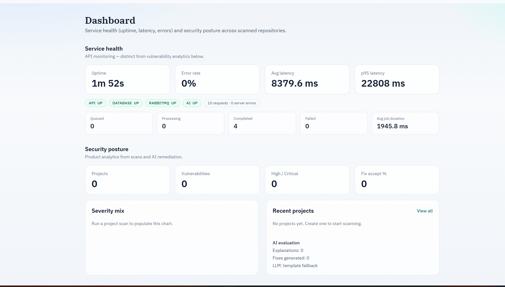
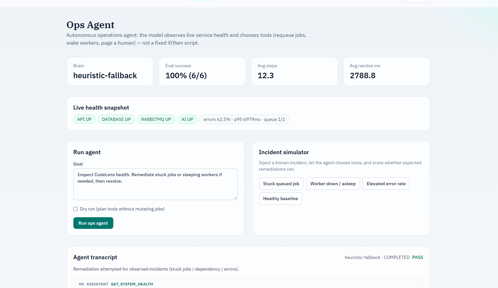
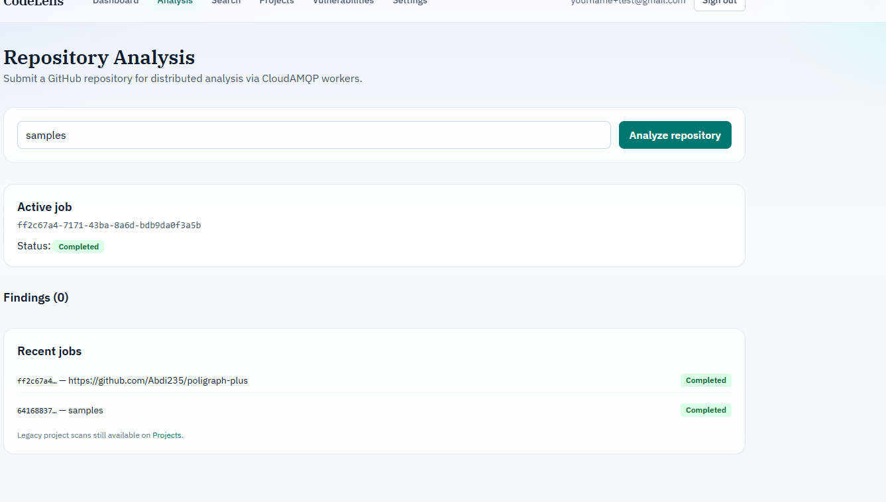
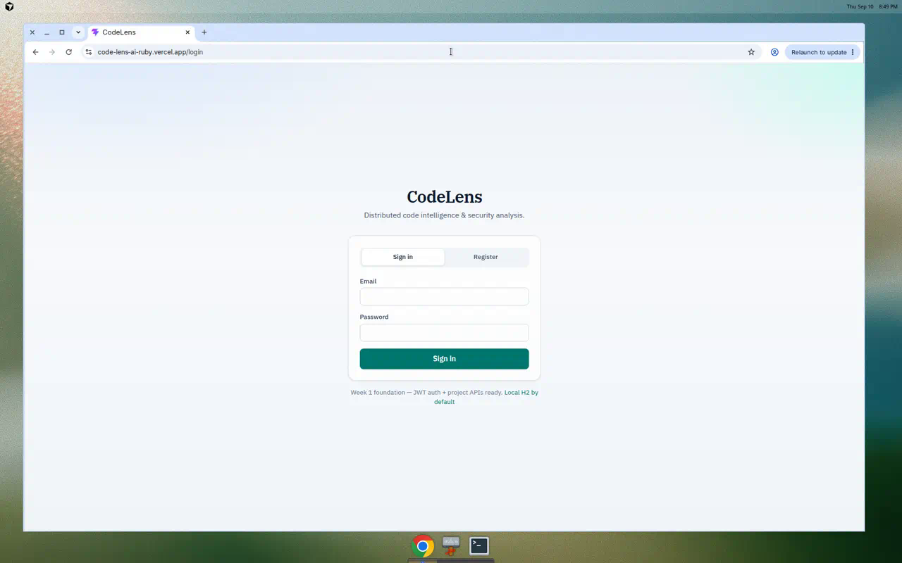

# CodeLens

**Distributed code intelligence, security analysis, and autonomous ops remediation.**

CodeLens analyzes GitHub repositories for vulnerabilities, indexes code for BM25 search, streams job status over WebSockets, and runs a tool-using **Ops Agent** against live service health metrics.

[](https://code-lens-ai-ruby.vercel.app)
[](https://codelens-api-wym7.onrender.com/actuator/health)
[](LICENSE)

---

## Live demo

| Surface | URL |
| --- | --- |
| **Web app** | [https://code-lens-ai-ruby.vercel.app](https://code-lens-ai-ruby.vercel.app) |
| **API health** | [https://codelens-api-wym7.onrender.com/actuator/health](https://codelens-api-wym7.onrender.com/actuator/health) |

**Try it (2 minutes)**

1. Open the web app → **Register**
2. **Analysis** → submit `samples` → wait for **Completed** → review findings
3. **Search** → query `password` on that job
4. **Ops Agent** → run **Stuck queued job** → confirm **PASS** and tool transcript

> Free-tier hosts may sleep when idle. The first request can take 30–90 seconds.

<p align="center">
  
</p>

<p align="center">
  
</p>

<p align="center">
  
</p>

<p align="center">
  
</p>

---

## Why CodeLens

| Capability | What you get |
| --- | --- |
| **Distributed analysis** | CloudAMQP workers process repos asynchronously (`QUEUED → PROCESSING → COMPLETED`) |
| **Code search** | BM25 + inverted index over chunked source |
| **Security findings** | Static rules with context retrieval and optional LLM explanations |
| **Service monitoring** | Uptime, latency, error rate, dependency health, pipeline counts |
| **Ops Agent** | Tool-using agent that *chooses* remediations from live metrics (not a fixed LLM slot) |

---

## Architecture

```
React (Vercel)
      │  REST + WebSocket
      ▼
Spring Boot API (Render)
      ├────────────────┐
      ▼                ▼
 PostgreSQL      CloudAMQP (RabbitMQ)
                       │
            ┌──────────┴──────────┐
            ▼                     ▼
     Python worker(s)        AI service
            └──────────┬──────────┘
                       ▼
    Clone → Parse → Index → Retrieve → Scan → LLM → Postgres
```

| Layer | Stack |
| --- | --- |
| Frontend | React 19, TypeScript, Vite, Tailwind |
| API | Spring Boot 4, JWT, JPA, WebSocket, Actuator |
| Queue | CloudAMQP (`RABBITMQ_URL`) |
| Workers | Python 3.13, pika |
| Data | PostgreSQL 16 (H2 for local/dev) |
| LLM | OpenAI (optional) |

No AWS. Messaging is CloudAMQP; compute is Render + Vercel.

---

## Features

- Async repository analysis with WebSocket status updates  
- Multi-worker consumption (prefetch=1, retries, DLQ, idempotent claim)  
- AST / heuristic parsing + BM25 retrieval search API  
- Security scan findings with remediation text  
- Dashboard **service health** (uptime, p95 latency, error rate, deps, pipeline)  
- **Ops Agent** with tools: `get_system_health`, `list_stuck_jobs`, `requeue_job`, `wake_worker`, `wake_ai`, `page_human`, `resolve_incident`  
- Incident simulator + eval metrics (`success rate`, avg steps, resolve time)  

---

## Ops Agent (agentic remediation)

The Ops Agent observes `/api/metrics/system` and **selects tools** to remediate incidents.

- With `OPENAI_API_KEY`: OpenAI **tool-calling** brain (`openai-tool-calling`)  
- Without a key: labeled `heuristic-fallback` for local/CI demos  

Endpoints: `POST /api/ops-agent/run`, `POST /api/ops-agent/simulate`, `GET /api/ops-agent/eval`

---

## Email service sign-in (OAuth)

Sign in with **Gmail / Google** or **Outlook / Microsoft**: choose a provider → authenticate there → return to the CodeLens dashboard.

Set on the API:

| Variable | Purpose |
| --- | --- |
| `FRONTEND_URL` | Vercel app URL |
| `API_PUBLIC_URL` | Public API URL (OAuth callback base) |
| `OAUTH_GOOGLE_CLIENT_ID` / `SECRET` | Google Cloud OAuth client |
| `OAUTH_MICROSOFT_CLIENT_ID` / `SECRET` | Entra app registration |

Redirect URIs:

- `{API_PUBLIC_URL}/api/auth/oauth/google/callback`
- `{API_PUBLIC_URL}/api/auth/oauth/microsoft/callback`

### Welcome email

New accounts (OAuth or email/password) get a welcome email describing CodeLens when SMTP is enabled (`MAIL_ENABLED=true` + `MAIL_HOST` / credentials). See [docs/render-deployment.md](docs/render-deployment.md).

---

## Quick start (local)

```bash
cp .env.example .env
# Set RABBITMQ_URL from CloudAMQP (required for the queue)

docker compose up --build
```

| Service | URL |
| --- | --- |
| Frontend | http://localhost:3000 |
| API | http://localhost:8080 |

### Core environment variables

| Variable | Required | Description |
| --- | --- | --- |
| `RABBITMQ_URL` | Yes (queue) | CloudAMQP AMQP URL |
| `DATABASE_URL` | Prod | PostgreSQL connection string |
| `JWT_SECRET` | Yes | JWT signing secret |
| `OPENAI_API_KEY` | No | LLM explanations + Ops Agent tool-calling |
| `WORKER_URL` | Prod (ops) | Worker public URL for wake checks |
| `VITE_API_URL` | Vercel | Public API base URL (no trailing slash) |

---

## API (selected)

| Method | Path | Description |
| --- | --- | --- |
| `POST` | `/api/auth/register` | Create account |
| `POST` | `/api/analysis` | Start analysis job |
| `GET` | `/api/analysis/{jobId}/results` | Findings |
| `GET` | `/api/search?jobId=&q=` | BM25 code search |
| `GET` | `/api/metrics/system` | Service health snapshot |
| `POST` | `/api/ops-agent/simulate` | Run incident simulation |

---

## Testing

```bash
cd backend && ./mvnw test
cd ai-service && PYTHONPATH=. python -m pytest tests/ -v
cd frontend && npm test && npm run build
```

Search benchmark:

```bash
cd ai-service && PYTHONPATH=. python scripts/benchmark_search.py
```

---

## Deployment notes

- **Render:** `codelens-api`, `codelens-ai`, `codelens-worker`, `codelens-db`  
- **Vercel:** frontend root `frontend`, env `VITE_API_URL=https://codelens-api-wym7.onrender.com`  
- Free tiers sleep when idle; warm with a health check before demos  

See [docs/render-deployment.md](docs/render-deployment.md).

---

## Known limitations

- Lexical BM25 only (no embedding / semantic search yet)  
- Internal Java package remains `com.secureai`  
- Free-tier CloudAMQP / Render / Vercel have cold starts and usage limits  
- True worker autoscaling requires a paid Render plan  

---

## License

MIT
